Android App
===========

A continuación vamos a mostrar algunos flujos comunes sobre cómo utilizar la aplicación

## Registro y login

Para comenzar a utilizar la aplicación lo primero que debemos hacer es registrarnos. Para esto haremos click en el text "Registrate" que aparece en la pantalla de Login.

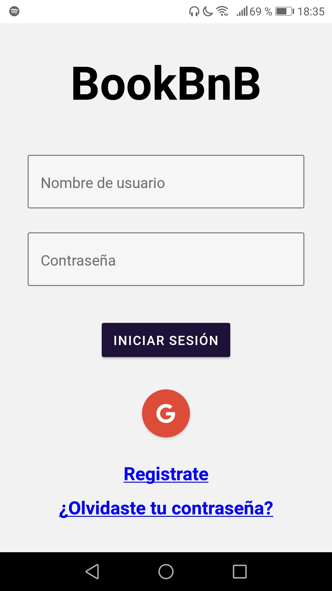

Una vez hecho esto seremos redirigidos a la pantalla de registro. Aquí debemos completar con nuestros datos junto con la contraseña. 

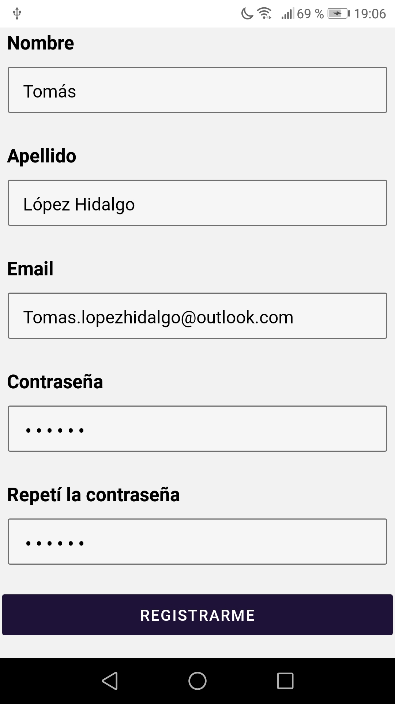

Finalmente, una vez completados todos los campos tocaremos el botón "REGISTRARME". Aquí volveremos al pantalla de Login indicándonos que el registro fue exitoso. Para loguearnos con la nueva cuenta que acabamos de crear deberemos llenar el login con los datos que usamos para registrarnos

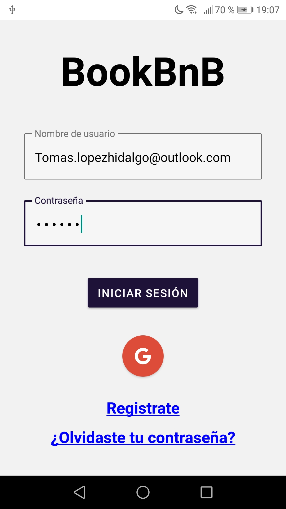

Aquí tocamos el botón "INICIAR SESIÓN" y finalmente podemos utilizar al aplicación

## Menúes y navegación

Veremos a continuación la composición del menú de nuestra aplicación y que contiene cada uno. Para ingresar a este menú deberemos swipear desde la izquierda de la pantalla. Una vez hecho esto de desplegará el siguiente menú con las opciones de navegación. 

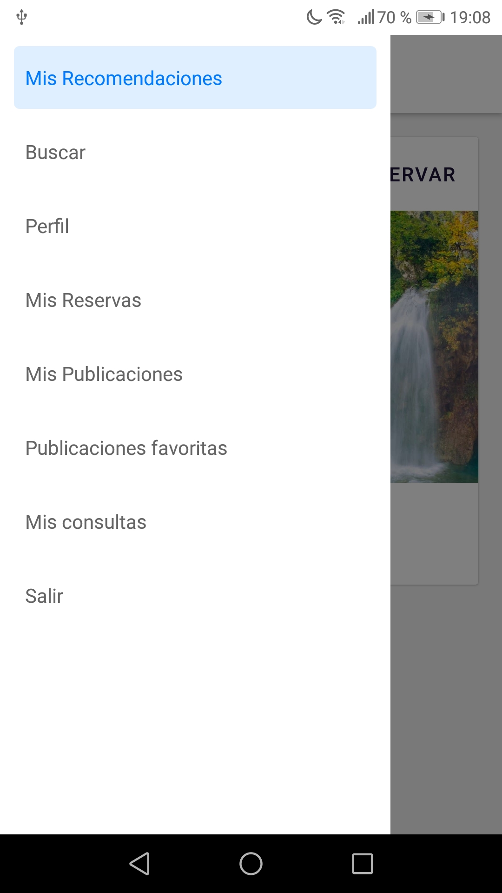

Vemos entonces que tenemos las siguientes pantallas:

- _**Mis Recomendaciones**_: Esta sección contiene las recomendaciones que nos provee la aplicación en base a lo más popular que haya publicado.

- _**Buscar**_: Esta sección nos permitirá realizar búsquedas con distintos filtros sobre las publicaciones que existen y no está n bloqueadas.

- _**Perfil**_: Esta sección nos permite acceder a la gestión de nuestro perfil en la aplicación. Esto es: editarlo y visualizarlo

- _**Mis Reservas**_: Esta sección nos permitirá acceder a todas las reservas que hayamos hecho.

- _**Mis Publicaciones**_: Esta sección nos permitirá conocer qué es lo que hemos publicado y acceder a ese contenido muy fácilmente.

- _**Publicaciones favoritas**_: Esta sección contiene las publicaciones que hemos marcado como favoritas. Ya sean propias o de otros usuarios.

- _**Mis consultas**_: Esta sección contiene las consultas privadas que hayamos realizado a otros usuarios.

- _**Salir**_: Esta sección nos permitirá deslogearnos de nuestro usuario, ya sea para acceder con otro o porque deseamos simplemente cerrar sesión.

Para acceder a cualquiera de las secciones bastará simplemente con tocar el título de la misma en el menú. En cualquier momento estará disponible este menú para navegar por aplicación, a excepción de aquellos casos en que no estemos deslogueados

## Perfil

### Visualización de perfil

Una vez que hemos aprendido a darnos de alta en la aplicación y como loguearnos querríamos vernos como nos ven los demás usuarios (y en todo caso, cambiarlo). Para esto existe la sección "Perfil" que nos nombramos anteriormente. Para esto basta con desplegar el menú de navegación e ir a la solapa llamada "Perfil". Una vez allí podremos visualizar algo como lo siguiente:

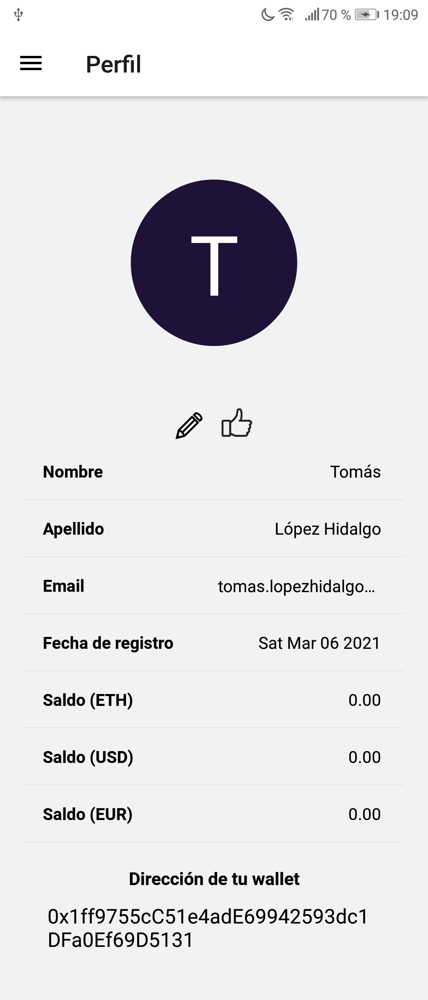

Podemos visualizar entonces nuestros datos personales:

- **Email**: Este es el email con que nos registramos en la aplicación. Aquí será donde nos envíen el email para recuperar nuestra contraseña y cualquier contacto que se necesite del usuario. 

- **Nombre**: Este es el nombre con que nos registramos en la aplicación. Es el que aparecerá cuando hagamos una reserva y el mismo que aparecerá cuando hagamos consultas privadas a otros usuarios.

- **Fecha de registro**: Esta es la fecha con que nos registramos en la aplicación. 

- **Saldo**: Este punto es importante ya que nos indica qué saldo tenemos disponible actualmente en la aplicación para hacer reservas y publicaciones. Además de la cantidad de ethers que tenemos (ETH). Tenemos la cotización de esos Ethers en diferentes monedas para el momento en que visitamos nuestro perfil. En este caso podemos ver que tenemos 0 Ethers ya que recién nos acabamos de registrar, y todavía no nos cargaron saldo.

- **Dirección de nuestra wallet**: Este punto nos indica cuál es la dirección de nuestra billetera virtual. Es decir, a dónde deberán enviarnos dinero. Si tocamos este campo y mantenemos el dedo podremos observar que este campo es copiable, esto lo que nos permite es pasarles esta dirección fácilmente a nuestros amigos.

### Edición de perfil

Para editar nuestro perfil deberemos ir a la solapa de "Perfil". Una vez allí deberemos tocar el ícono del lápiz. Esto nos llevará a otra ventana la cual se verá así:

Una vez aquí podremos observar la información actual de nuestro perfil junto con los datos.

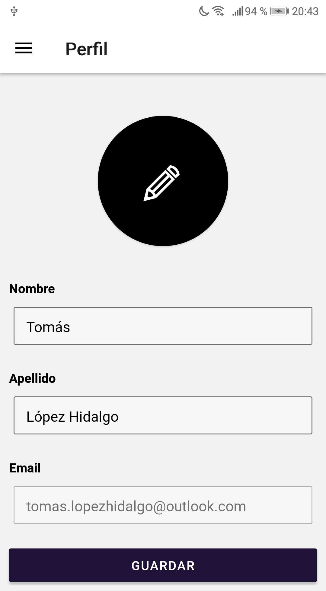

Para modificar entonces alguno de ellos deberemos actualizar ese campo y tocar el botón de **"GUARDAR"**

## Publicaciones

### Dar de alta una publicación

Para comenzar a publicar deberemos ir a la solapa de **"Mis Publicaciones"**. Una vez aquí podremos visualizar las publicaciones que ya hemos hecho junto con la posibilidad de hacer nuevas. En este caso no tenemos ninguna hecha ya que acabamos de crear al usuario. Por lo que procedermos a publicar algo.

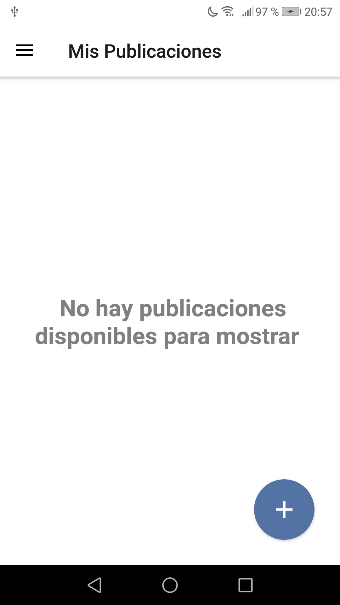

Tocamos el botón de **+** el cuál nos llevará a la siguiente pantalla:

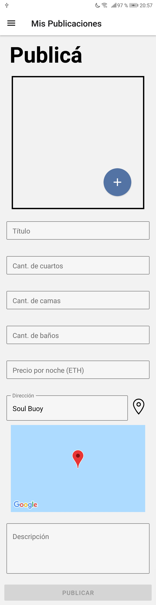

Una vez aquí deberemos llenar los datos de la publicación con el título, cantidad de cuartos, camas, etc. y el precio por noche (que será lo que se le cobrará por cada noche de reserva a los huéspedes). Debemos asegurarnos también de tener saldo disponible en nuestra billetera ya que se nos cobra una pequeña comisión por cada publicación que hagamos (en este caso nos cargamos un par de ethers a nuestra cuenta para poder publicar).

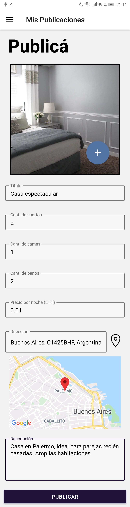

Una vez que hayamos hecho esto (vemos como nos debería quedar la publicación con todos los datos cargados) tocamos el botón **"PUBLICAR"**. Esto, si se cumplen las precondiciones (tener saldo), hará la publicacion y nos redigirá a la pantalla de **"Mis Publicaciones"**, esta vez con la nueva publicación que acabamos de hacer.

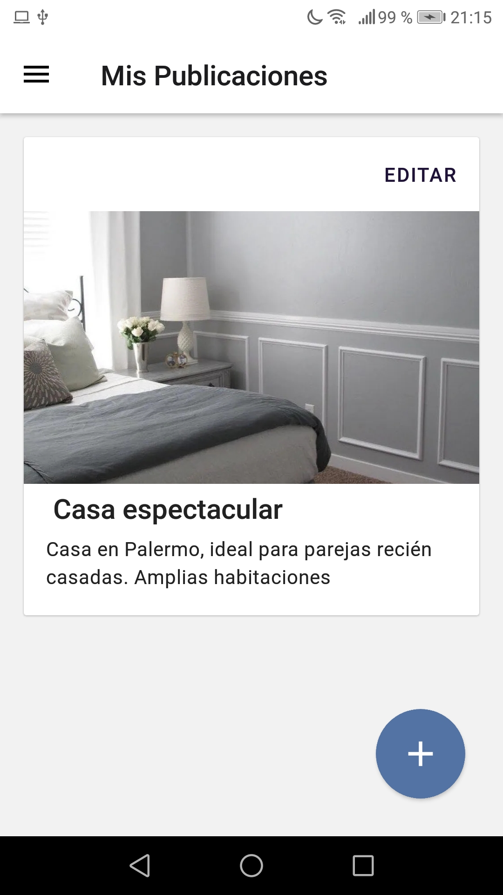

### Edición de una publicación

Lo primero que debemos hacer para editar alguna de nuestras publicaciones, es ir a la solapa de **"Mis Publicaciones"**. Aquí tocaremos el botón que dice **"Editar"** en la publicación que deseemos hacer cambios. 

Una vez aquí veremos la publicación junto con sus datos cargados (como si recién los hubiesemos llenado). Entonces modificamos los campos que deseamos a nuestro gusto y tocamos el botón de **"PUBLICAR"**. El mismo reflejará los cambios en la publicación y nos devoverá a la pantalla de **"Mis publicaciones"**

## Reservas

### Resevar un lugar

Para realizar una reserva lo primero que deberemos hacer es ir a la publicación que deseamos reservar. Veremos algo así:

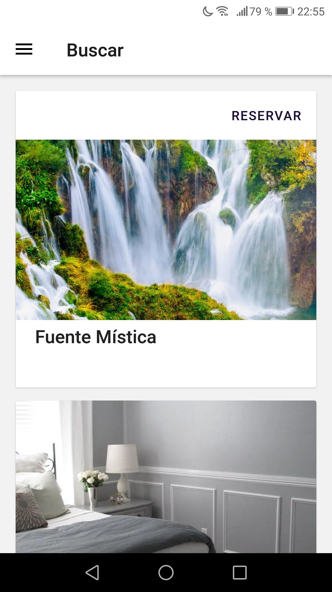

Para encontrar una publicación reservable podemos hacerlo por las búsquedas o mismo por las recomendaciones. Sin importar como lleguemos a la publicación para realizar la reserva debermos tocar el botón que dice **"Reservar"**. Esto nos llevará a la siguiente pantalla:

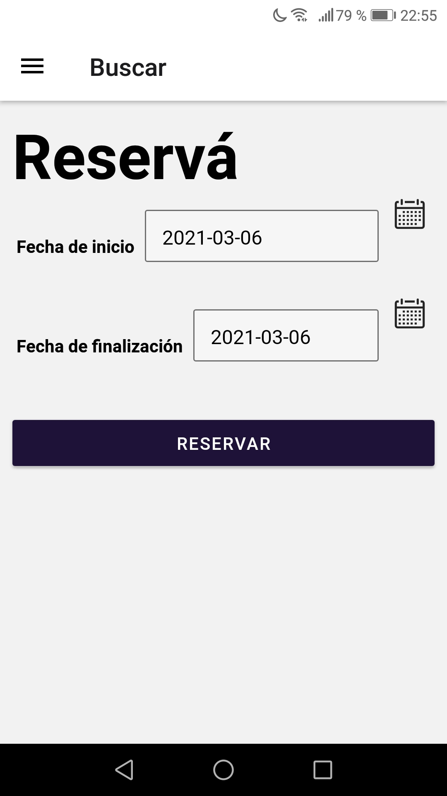

En esta pantalla deberemos completar con los datos de la nueva reserva, esto es: la fecha de checkin y la fecha de checkout. Para esto bastará con tocar alguno de los calendarios y completar la fecha correspondiente. Las cuáles lógicamente tienen que tener por lo menos un día de diferencia, y la fecha de checkout debe ser posterior a la de checkin. Esto lo que hará es crear un intento de reserva. Es decir, el dueño de la publicación tendrá que aceptar la reserva que nosotros proponemos y recién ahí quedará en estado confirmada. El precio que se nos descontará entonces es la cantida de noches por el precio unitario de la misma.

Una vez creado el intento de reserva se nos redigirá a la pantalla de nuestras reservas en la cuál se mostrará la cantidad de reservas que tenemos y su estado (los cuales pueden ser):

 - **Aceptado**: el dueño de la publicación aceptó la reserva y la misma quedó confirmada en el sistema. En este caso se descuenta la plata del dueño de la reserva (inquilino) con un equivalente de la cantidad de noches por el precio unitario de cada una.
- **Rechazado**: el dueño de la publicación rechazó nuestro intento de reserva. En este caso la plata de la reserva se devuelve a nuestro monedero 
- **Pendiente**: el dueño de la reserva todavía no realizó ninguna acción. Es decir todavía no decidió si aceptarla o no

Una vez que realizamos entonces el intento de reserva visualizaremos algo como esto:

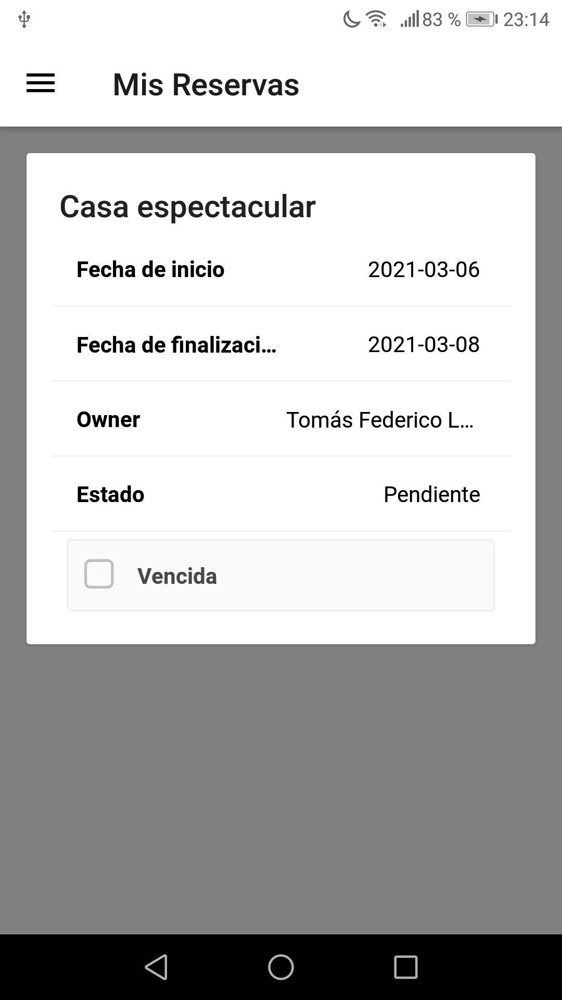

Aquí podemos observar toda la información de nuestra reserva. 

- **Fecha de inicio**: fecha de checkin de nuestra reserva. Esto es, a partir de qué día podemos hospedarnos en el lugar
- **Fecha de finalización**: fecha de checkout de nuestra reserva. Esto es, en qué día deberemos abandomar (como límite) el lugar
- **Owner**: dueño de la reserva, en este caso nosotros
- **Estado**: Estado de la reserva, son los etados que mencionamos anteriormente.
- **Vencida**: podemos además observar si la reserva está o no cumplida. Una vez que se cumple la fecha de checkout la reserva se considera vencida y se podrá calificar nuestra experiencia en el lugar

### Gestión de reservas de nuestras publicaciónes

Por otro lado, cuando publicamos nuestro lugar también se generan reservas de otros usuario hacia éste. Las cuales nosotros deberemos aceptar o rechazar de acuerdo a nuestras preferencias. 

Para gestionar esto lo que deberemos hacer es revisar periódicamente las publicaciones que hicimos y sus reservas asociadas. Para esto partimos de nuestras publicaciones

Luego entramos a la publicación de la cuál queremos gestionar sus reservas tocando la card correspondiente

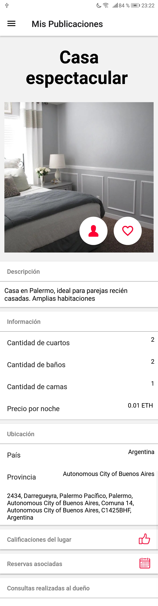

Una vez aquí tocamos el botón que dice **"Reservas asociadas"** el cuál nos redirigirá a las reservas que otros usuarios hayan hecho en esa publicación. Nosotros desde aquí podremos gestionar (es decir, aceptar o rechazar) las mismas.

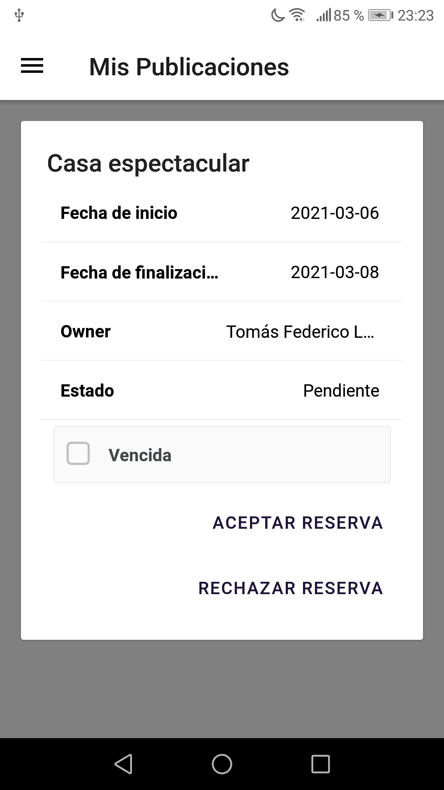

Para esto tocaremos el botón correspondiente (para aceptar o rechazar). En este caso aceptamos la reserva por lo que la misma deberá cambiar de estado. Puede que requiera salir y volver a entrar a la pantalla para visualizar el cambio de estado

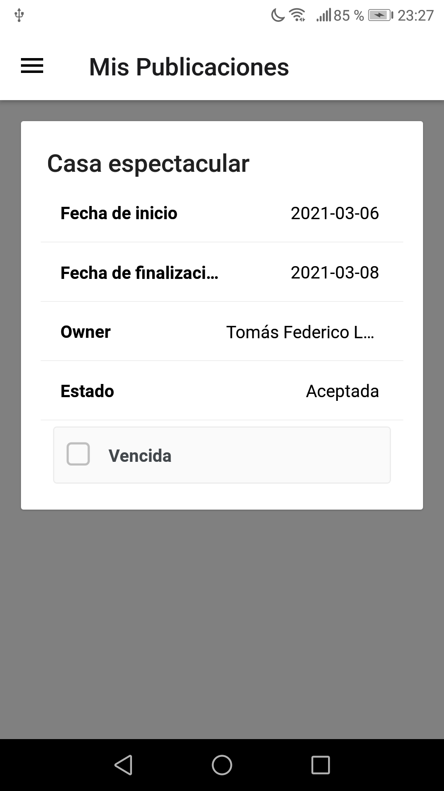

Una vez aceptada la reserva se actualizarán las billteras de ambos usuarios con los nuevos montos. Acreditándole al dueño de la publicación (en el caso de aceptar) la correspondiente ganancia de la reserva.

## Consultas

Puede que ante la duda de una nueva reserva deseemos saber un poco más de la publicación, o incluso más acerca del dueño, por lo que en este caso entran en juego las consultas tanto públicas como privadas

### Realizar consultas públicas

Para realizar una consulta púbica deberemos primeramente acceder a la publicación sobre la cuál queremos consultar. Una vez allí deberemos navegar hasta el fondo de la misma en la cuál veremos la caja de consultas públicas.

Para realizar entonces una consulta escribiremos el texto que queramos y tocaremos en **"CONSULTAR"**

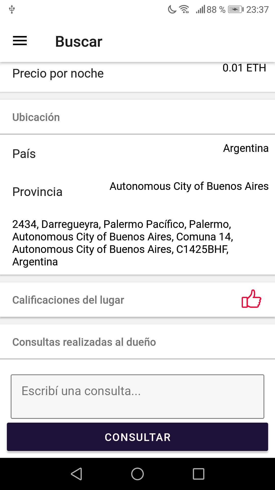

Por ejemplo nosotros queremos consultar por la zona en que se encuentra la publicación, entonces escribimos la consulta y la envíamos:

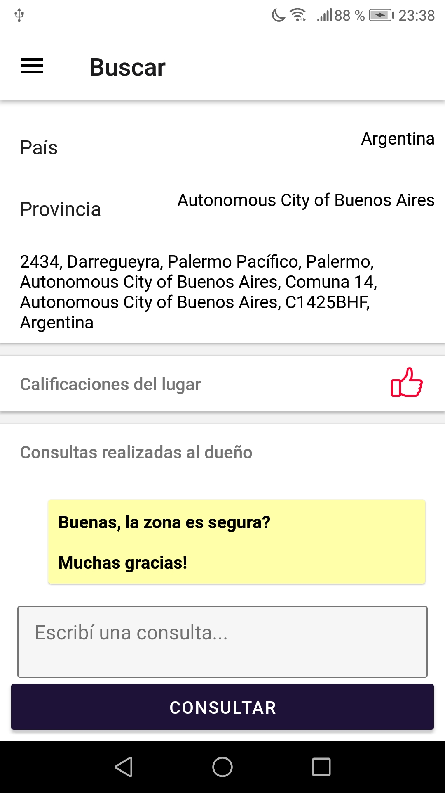

### Responder consultas públicas

Por otro lado, como dueño de la publicación habrá gente que nos haga consultas públicas y nosotros deberemos responder. Retomando  con el ejemplo anterior y suponiendo que somos los dueños de la publicación, para responder a consultas públicas deberemos a la publicación y en particular a su caja de comentarios (al fondo de la misma). Una vez aquí lo que deberemos hacer es seleccionar la consulta que queremos responder (lo hacemos tocando el comentario en sí, el mismo se mostrará en violeta). Una vez seleccionado el comentario s e nos abrirá la caja de consultas para poder responder. Una vez que terminamos tocamos **"ENVIAR"** y la consulta pública quedará respondida. Mostramos el flujo a continuación:

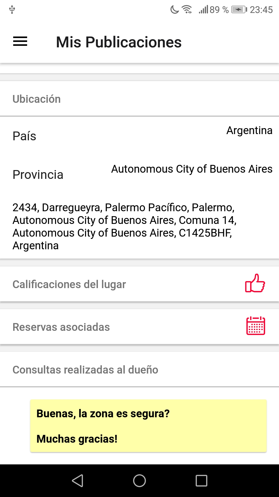
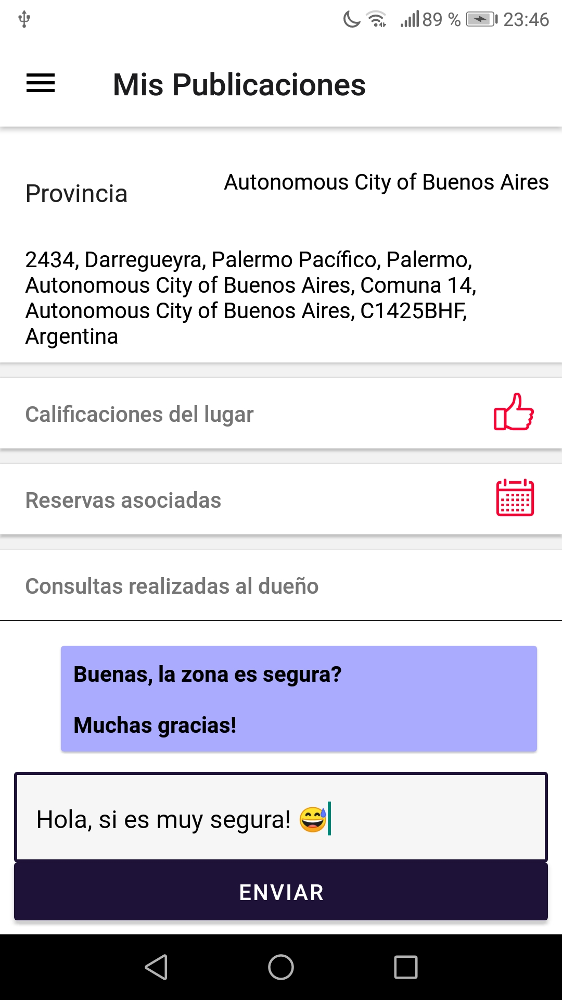
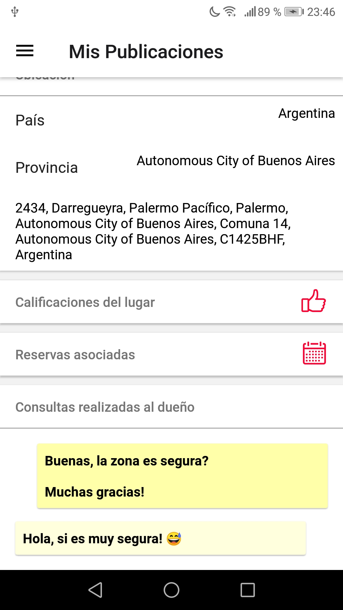

### Realizar consultas privadas

Además existen casos en que no queremos que nuestras consultas sean vistas por todas las personas. Por lo que lo mejor en estos casos es realizar una consulta privada. Para esto deberemos ir nuevamente a la publicación de la cuál deseamos realizar la consulta. Una vez aquí deberemos visitar el perfil de publicante (esto se hace tocando el ícono de **Perfil** que aparece en la publicación). Una vez en el perfil tocamos el icono de mensaje ("Carta"). Esto nos abrirá una nueva ventana de conversación (con forma de chat) para pode consultarle al dueño las dudas que tengamos.

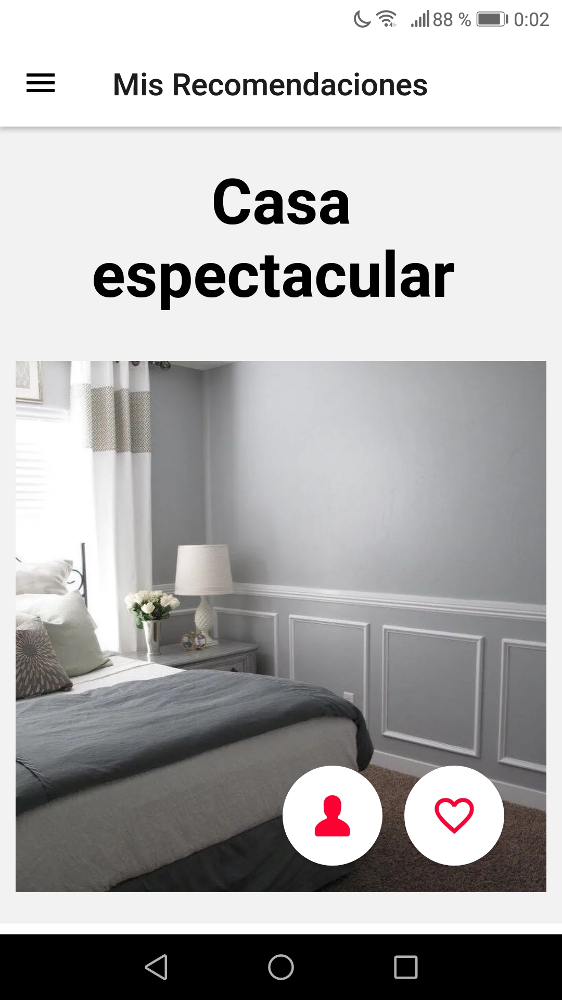
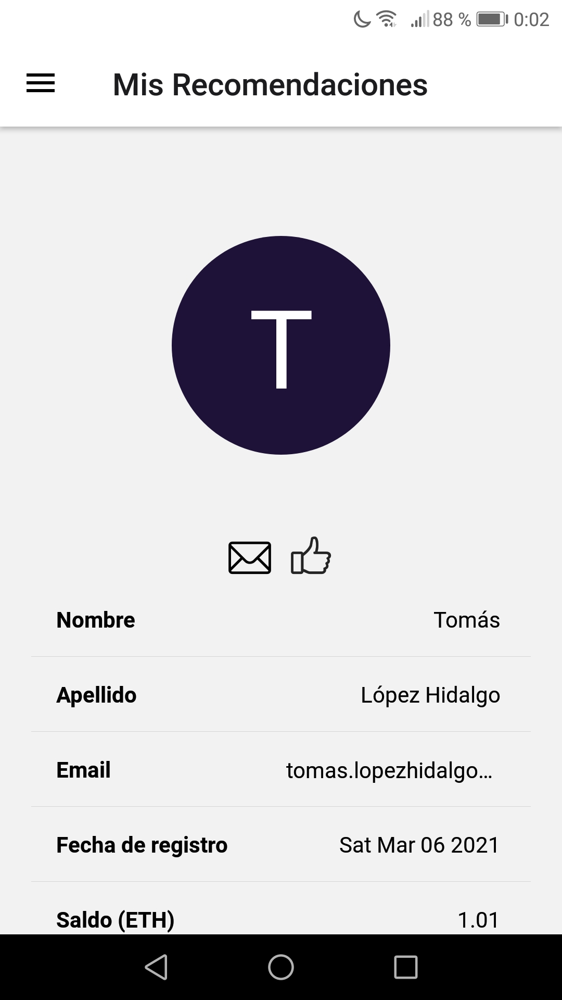
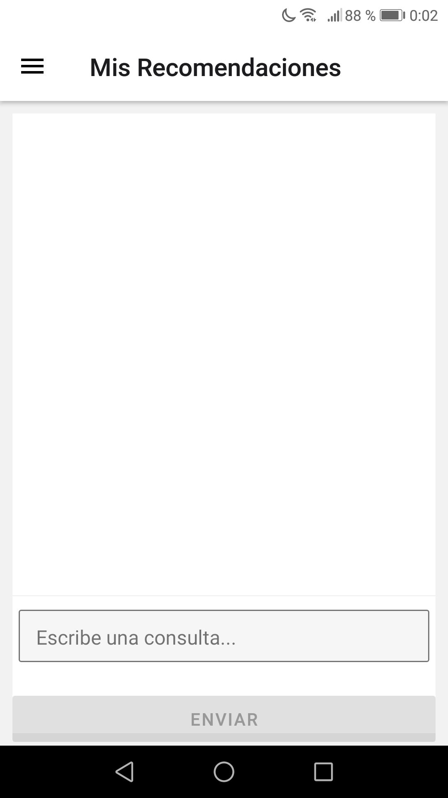
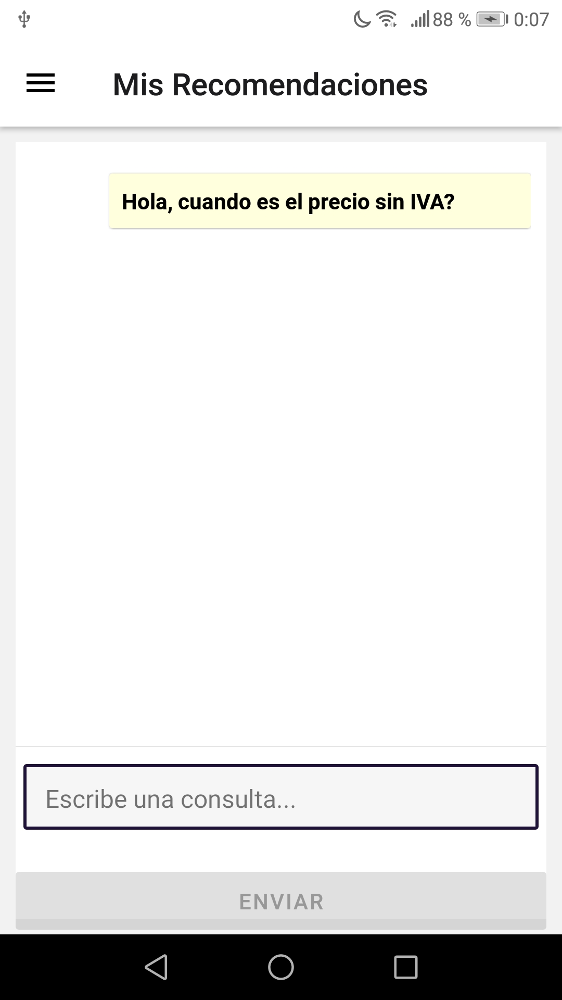

De esta forma se enviará una notificación al dueño sobre la nueva consulta la cuál el podrá responder.

### Responder consultas privadas

Para responder consultas privadas el dueño del lugar deberá visitar la solapa de **"Mis consultas"** del menú principal. Aquí podrá visualizar una lista de personas de las cuales recibió consultas y podrá responder cada una como si fuese un chat. Una vez elegido a quíen responderle con tocar su nombre de usuario podrá acceder a la conversación

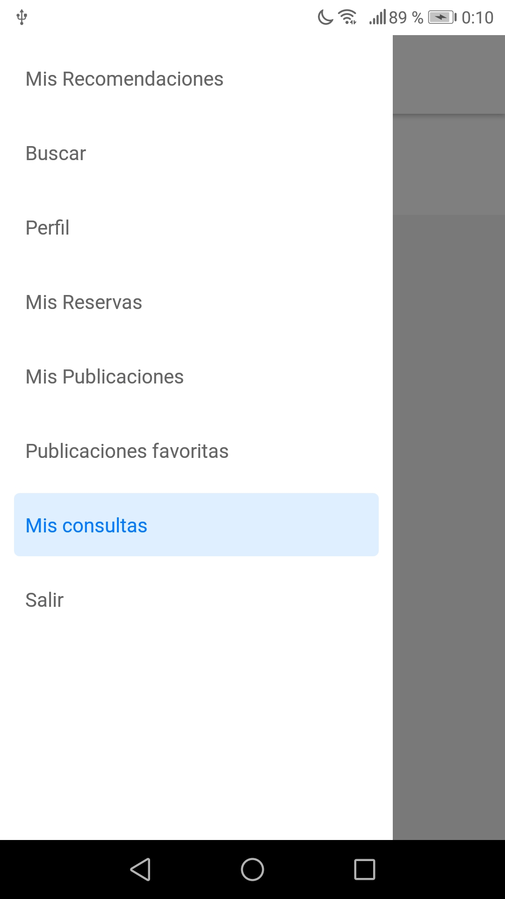
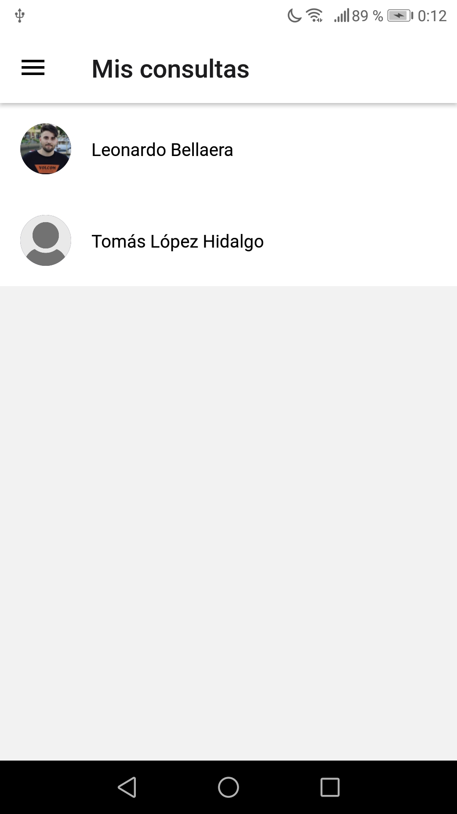
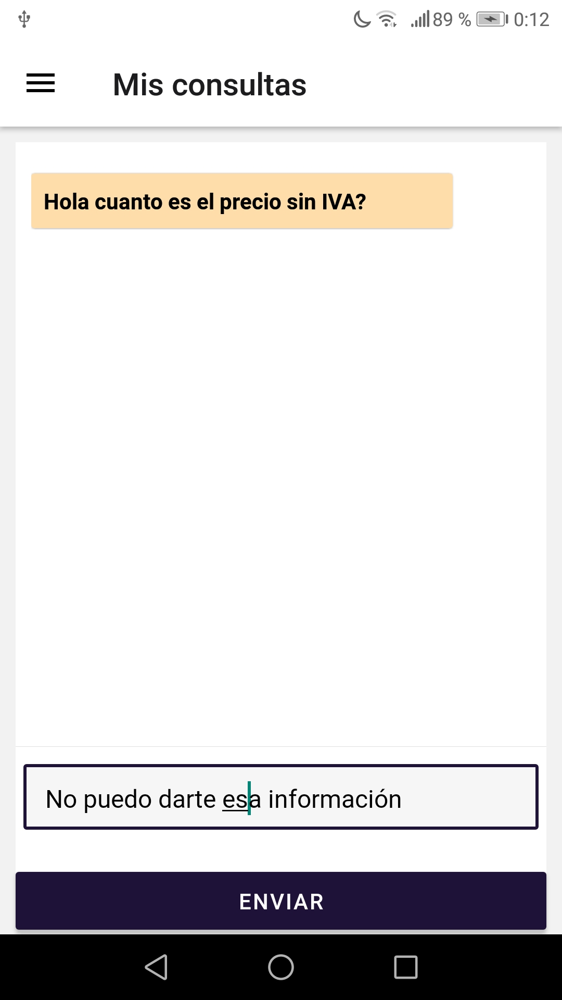
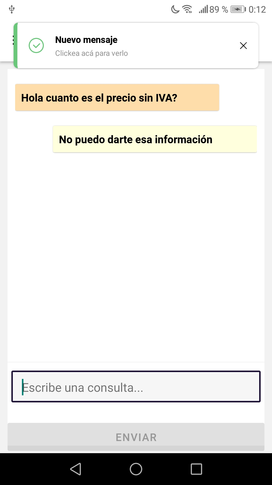

## Búsquedas

Podemos querer también encontrar lugares por características, ya sea precio, cantidad de habitaciones, lugar, etc. Para esto existe el panel de búsqueda. Para acceder basta con ir a la solapa de **"Buscar"**.  Una vez aquí tendremos la posibilidad de completar todas las características que deseemos sobre el lugar

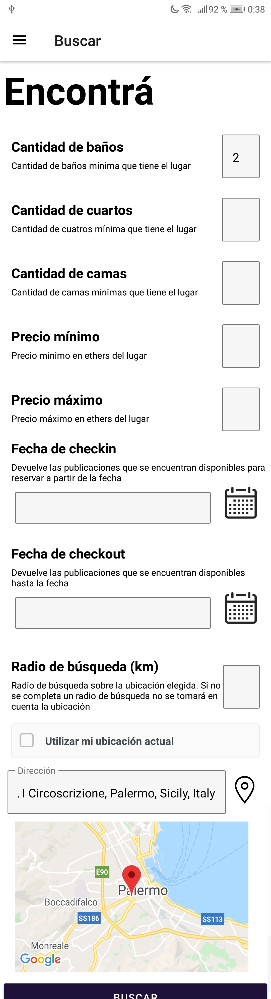

Tenemos entonces los siguientes filtros:
- **Cantidad de baños**: esto se refiere a la cantidad de baños mínima que tiene que tener el lugar
- **Cantidad de cuartos**: esto se refiere a la cantidad de cuartos mínima que tiene que tener el lugar
- **Cantidad de camas**: esto se refiere a la cantidad de camas mínima que tiene que tener el lugar
- **Precio mínimo por noche**: esto se refiere al precio mínimo que debe tener el lugar por noche
- **Precio máximo por noche**: esto se refiere al precio máximo que debe tener el lugar por noche
- **Fecha de checkin**: Filtra las publicaciones por la fecha de checkin. Para editar tocar el calendario
- **Fecha de checkout**: Filtra las publicaciones por la fecha de checkout. Para editar tocar el calendario
- **Ubicación**: en este campo podemos o bien escribir una dirección sobre la cuál buscar o podemos tildar la opción "Utilizar mi ubicación actual", en este caso el sistema tomará la ubicación actual del GPS

Una vez hayamos completado los filtros que nos parezcan oportunos tocaremos el botón "BUSCAR" que nos devolverá las publicaciones que matcheen.

## Calificaciones

### Calificar huésped

Para calificar un huésped tenemos que tener alguna reserva que haya hecho esa persona y que la misma esté vencida. Recién cuando la reserva esté vencida es cuando se habilitará la opción de dejar una review del huésped.

Para esto debemos ir a las reservas asociadas al lugar que tengamos publicados y una vez allí deberemos tocar el **"CALIFICAR HUÉSPED"**. El cual nos llevará a la pantall de reviews generales de esa persona. Una vez aquí escribimos un comentario y seleccionamos la cantidad de estrellas  que le damos a ese huésped. Las posibildades de puntaje que tenemos son: "Muy bueno", "Bueno", "Malo", "Muy malo". Cuando hayamos terminado tocamos el botón de **"ENVIAR"**. Dejamos a continuación imágenes del circuito cimpleto.

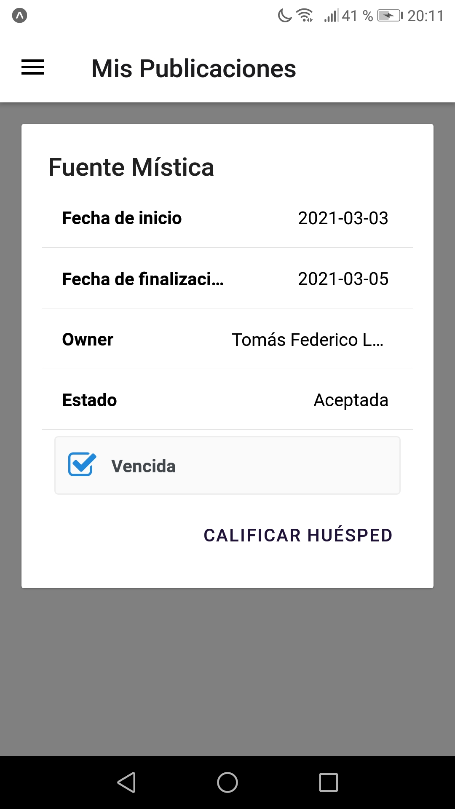
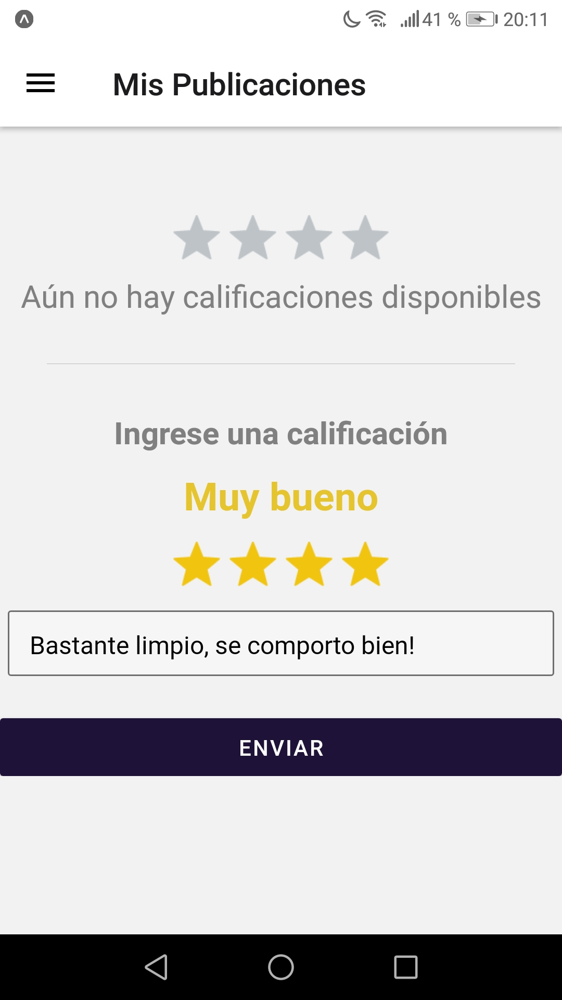
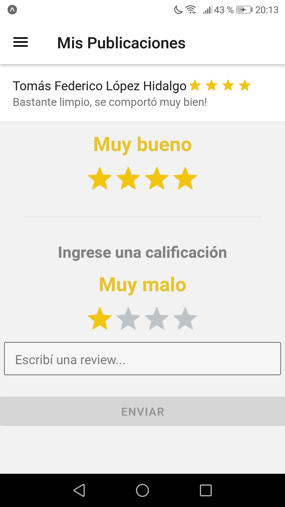

### Calificar lugar

Para calificar un lugar el flujo es muy parecido a la calificación del huésped. Comenzamos yendo a la solapa de **"Mis Reservas"**. Una vez aquí veremos las reservas que tenemos vencidas y cuáles son las que podemos calificar. Para esto se habilitará el botón de **"Calificar lugar"**. Cuando toquemos este botón se nos abrirá la pantalla de reviews de la publicación y nos dará la posibilidad de dejar una nueva. Para esto escribimos un comentario y tocamos una puntuación en estrellas (aquí nuevamente las opciones son "Muy bueno, ""Bueno", "Malo", "Muy malo"). Una vez hayamos hecho esto tocamos el botón **"ENVIAR"**, la cuál dejará la review visible para el resto de los usuarios

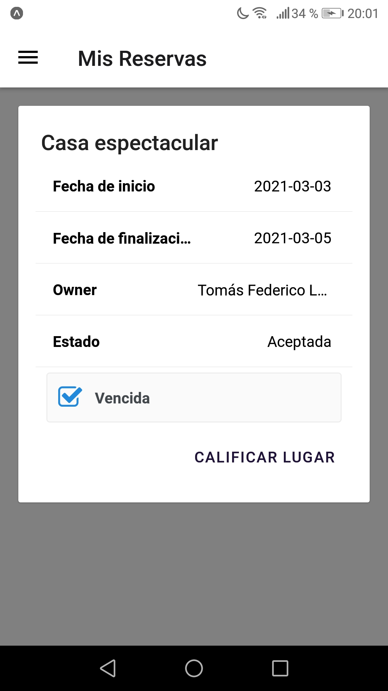
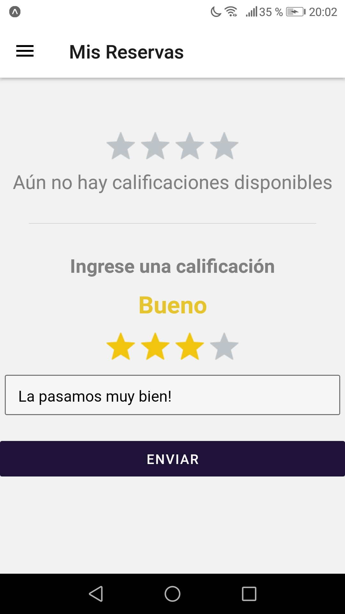
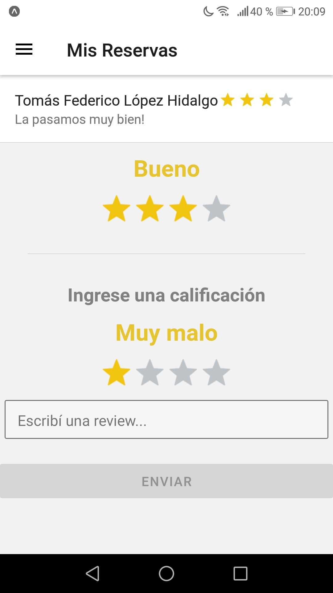

